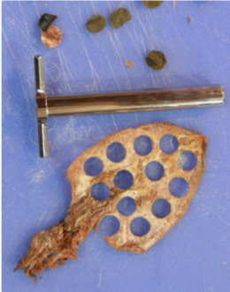

# Squidpop Methods

## Overview

The basic assay involves attaching standardized pieces of animal food to a plastic stake  (“Squidpop”), deploying the stake in a shallow water habitat, retrieving the stake after 24 hours, and scoring whether the food is present or absent. We use food that should be readily available throughout the world and is easy to work with. The simulated animal prey is a piece of dried squid mantle tissue. Dried whole squid is available in many Asian grocery stores as well as online; it is important to get the type of squid in which the squid’s mantle (main part of body) remains whole, resembling a flattened sheet (see materials appendix for sources).

Figure 1. Dried squid, with discs removed

## Materials Needed:

| ITEM                                                 | QUANTITY          |
|------------------------------------------------------|-------------------|
| dried squid mantle (about 1.3 cm diameter circle)    | 25 per deployment |
| auger hole punch or cork borer (1.3 cm diameter)     | 1                 |
| green fiberglass garden stakes (~50cm)               | 25 per deployment |
| fine monofilament fishing line (2-10 lb. or similar) | ~5 cm per stake   |
| electrical tape                                      | 1 roll            |
| sewing needle                                        | 1                 |
| scissors                                             | 1 pair            |

## Getting Prepared:

1.	Use auger punch to make 25 round pieces of dried squid mantle, 1.3 cm diameter (OR cut 1 x 1 cm squares).

2.	Pierce the squid with a needle threaded with a thin monofilament line. Wrap the line around the piece of squid and then tie a knot to the lead line to secure the squid to the line.

3.	Cut the line approximately 5 cm from the piece of squid. Affix line to the stake with tightly wrapped electrical tape. Wrap the free end of the line to the rod leaving approximately 1 cm in length for the tether (see photo).

  Note: keep the squid as dry as possible until deployment. The dried squid can become oily or slimy when immersed and may foul the water. We recommend keeping the squidpops in the refrigerator until deployment.

## Deploying Squidpops

4.	Deploy the array of squidpops at roughly the same depth in the same type of habitat. This may involve a linear or other arrangement according to the site conditions. The Squidpop rods should be stuck firmly and deeply into the sediment to prevent dislodgement by waves, drifting algae, energetic predators, etc., and spaced approximately 1-2 meters apart. Take care to deploy the rods in such a way that they can be easily relocated after 24 hours.

  Note: If using a GoPro to help identify fishes consuming the squid bait, deploy it underwater in such a way that you are able to capture several of the squidpops in the frame. This is not necessary but can be helpful determining what fish species actually consumed the bait. See additional protocols appendix II for more detailed instructions.

5.	Record the time of deployment, GPS coordinates (if possible), ambient weather conditions (sunny, partly cloudy, rainy, etc.), and water temperature (see additional protocol appendix II).

  Note: If not using GPS, be sure to note your relation to land features that will help you find the Squidpops later and identify your approximate GPS coordinates on Google Earth.

## Observing and Recording Data:

6.	1 hour after deployment: Examine the Squidpops in situ and record how many stakes have lost the squid bait. Make sure all 25 squidpops are still in place and be sure to note how many (if any) stakes have gone missing. Avoid disturbing or removing the stakes, which will be collected the following day. Bait loss is recorded as 'all or nothing', that is, to be counted as missing the entire disk of bait must be removed. There are no 'partial' counts.

  Note: leave all stakes deployed after 1 hour in place, regardless of whether the squid has been eaten or not. This will keep the number of stakes on-site constant and prevents confusion when collecting after 24 hours.

7.	24 hours after deployment: Recover the stakes as close to 24 hours after deployment as possible. Score in the same way as the one-hour observations. When you record the data make sure you clearly indicate that the number you wrote down is the number gone.

  Note: At 24 hours, record whether bait is missing from each of the 25 Squidpops, including those you already accounted for at 1 hour. This is to capture cumulative loss of bait. For example, if 5 pieces were gone at 1 hour, and an additional 10 were gone at 24 hours, you would record 15 pieces of bait missing after 24 hours.
